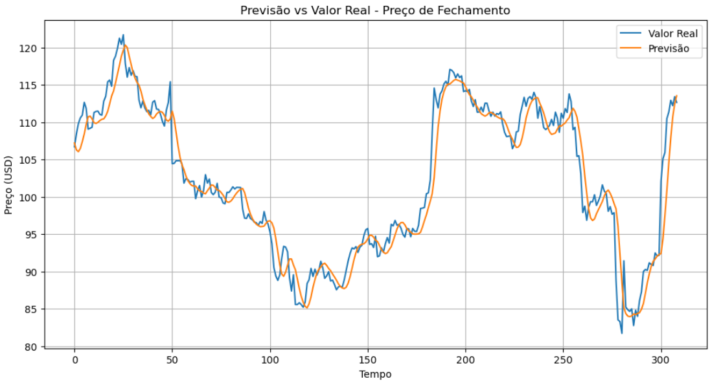

# 📈 Previsão de Preço com LSTM

Este projeto disponibiliza uma API construída com **FastAPI** que utiliza uma rede neural **LSTM** treinada para prever o próximo preço com base nos últimos 60 valores fornecidos. Também oferece uma interface web interativa que permite inserir os dados manualmente e visualizar a previsão diretamente pelo navegador.

---

## 🌐 Acesse Agora

Acesse a interface interativa do projeto:

🔗 [https://rede-neural-previsao-lstm-preco-acoes-production-2e30.up.railway.app](https://rede-neural-previsao-lstm-preco-acoes-production-2e30.up.railway.app)

---

## 🚀 Como usar a API

A API está disponível no seguinte endpoint:

```
POST https://rede-neural-previsao-lstm-preco-acoes-production-2e30.up.railway.app/predict
```

---

## 🔗 Requisição via Postman

### Corpo da requisição (JSON)

```json
{
  "prices": [
    104.23, 104.56, 104.78, 104.65, 104.81, 104.93, 105.12, 105.35, 105.67, 105.84,
    106.02, 105.97, 106.13, 106.38, 106.52, 106.71, 106.89, 106.74, 106.62, 106.45,
    106.58, 106.71, 106.86, 107.01, 107.14, 107.33, 107.46, 107.63, 107.88, 108.04,
    108.22, 108.41, 108.66, 108.79, 108.94, 109.11, 108.94, 108.77, 108.56, 108.38,
    108.16, 108.05, 108.12, 108.27, 108.49, 108.61, 108.73, 108.82, 108.69, 108.57,
    108.43, 108.28, 108.12, 107.97, 107.85, 107.68, 107.53, 107.42, 107.41, 107.45
  ]
}
```

⚠️ **Importante:** a lista `prices` **deve conter exatamente 60 valores** em escala real (não normalizada). A normalização é feita automaticamente pela API.

---

## ✅ Resposta esperada

```json
{
  "previsao": 107.04
}
```

---

## 📊 Resultado do modelo

### Previsão vs Valor Real



### Métricas de Avaliação

- **MAE (Erro Médio Absoluto)**: 1.88  
- **RMSE (Raiz do Erro Quadrático Médio)**: 2.75  
- **MAPE (Erro Percentual Médio Absoluto)**: 1.86%

> Essas métricas indicam que o modelo tem boa precisão, com um erro percentual médio inferior a 2%.

---

## 🛠 Tecnologias Utilizadas

- [FastAPI](https://fastapi.tiangolo.com/)
- [TensorFlow / Keras](https://www.tensorflow.org/)
- [scikit-learn (MinMaxScaler)](https://scikit-learn.org/)
- [Postman](https://www.postman.com/)
- [HTML + JS + CSS] (para o front-end)
- [Railway](https://railway.app/) (deploy)

---

## 📦 Estrutura do Projeto

```
projeto_lstm_api/
├── main.py               # Arquivo principal da API FastAPI
├── modelo_lstm_dis.h5    # Modelo LSTM treinado
├── utils.py              # Funções auxiliares (ex: normalização)
├── requirements.txt      # Dependências do projeto
└── static/
    └── index.html        # Interface web com formulário de preços
```

---

## 🧪 Como testar localmente

1. Instale as dependências:
```bash
pip install -r requirements.txt
```

2. Execute a aplicação:
```bash
uvicorn main:app --reload
```

3. Acesse:
- API: http://127.0.0.1:8000/predict
- Front-end: http://127.0.0.1:8000

---

## 🐳 Como rodar com Docker

```bash
docker build -t lstm-api .
docker run -d -p 8000:8000 lstm-api
```

---

## 📫 Contato

Caso tenha dúvidas ou sugestões, sinta-se à vontade para entrar em contato!